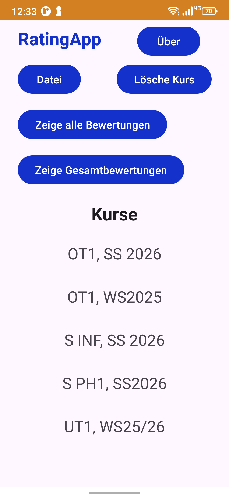

# RatingApp

Version 1.2.1

Mit der RatingApp kann man Bewertungen zu mehreren Kriterien von sonstigen Leistungen oder Prüfungsleistungen, wie z.B. mündlichen Beiträgen, Tests, Referaten, 
handwerkliche oder praktische Fertigkeiten, oder auch Hausarbeiten von Schüler:innen, Auszubildenden, Studierenden oder allgemein Personen im Unterricht, 
in Seminaren oder Kursen festhalten und als CSV-Dateien abspeichern. Zudem berechnet die App für jede Person kriterienbezogene 
Gesamtbewertungen aus allen durchgeführten Bewertungen innerhalb eines längeren Zeitraums, also z.B. aus allen Bewertungen im Laufe 
eines Schulhalbjahres oder Semesters.

In die App können Namenslisten von Personen eines Kurses als CSV-Datei eingelesen werden und erscheinen dann unter Kurse:  

Durch Tippen auf einen Kursnamen kommt man zur Ansicht, in der die Bewertungen erfolgen:

Die Bewertungen werden dabei durch Tippen auf einen Namen ausgewählt.

In den Einstellung können für jeden Kurs eine Bewertungsskala und die Anzahl der Bewertungskriterien festgelegt werden:

Aus allen für jede Person eingetragenen Bewertungen wird für jedes Kriterium eine Gesamtbewertung berechnet: 

Für jede Person erhält man auch eine Übersicht über alle zu einem Kriterium eingetragenen Bewertungen und die dazugehörige Gesamtbewertung:

Jede einzelne eingetragene Bewertung kann nachträglich geändert oder auch gelöscht werden: 

 

## Installation

Hier sind fertige Installationspakete für Android zu finden:
[releases](https://github.com/ReneJursa/RatingApp/releases/)

## Anleitung zum Programm

Eine Anleitung zum Programm ist hier zu finden: [Anleitung](doc/RatingApp_Anleitung_1.2.1.pdf). 

## Lizenz

Die RatingApp wird unter der GNU General Public License veröffentlicht.

Copyright (C) 2026 René Jursa

## Third Party Produkte

Die RatingApp enthält Open-Source Quellcode von:
*The Android Open Source Project, 2016: https://github.com/android/views-widgets-samples/tree/main/DataBindingDataBoundRecyclerView
*Vivek Vashistha, 2023: https://github.com/vkvashistha/AndroidUtils/tree/main/fileutils